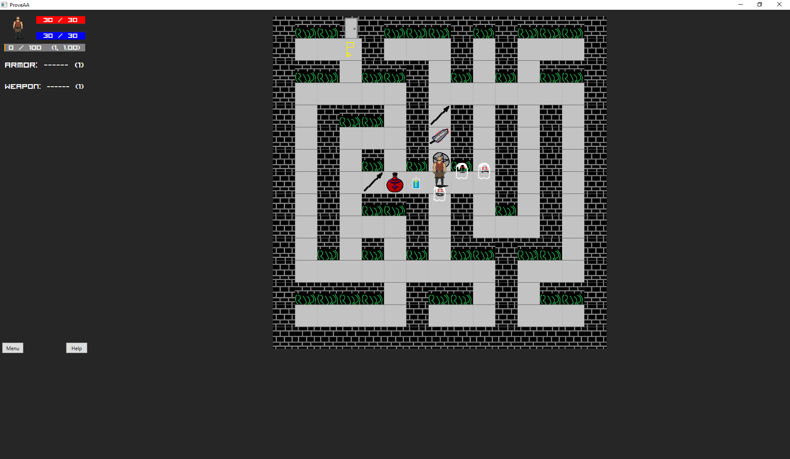
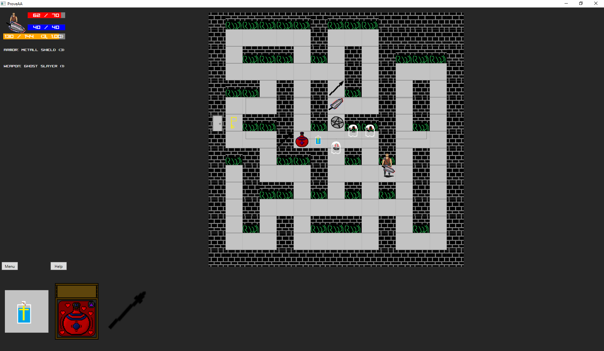
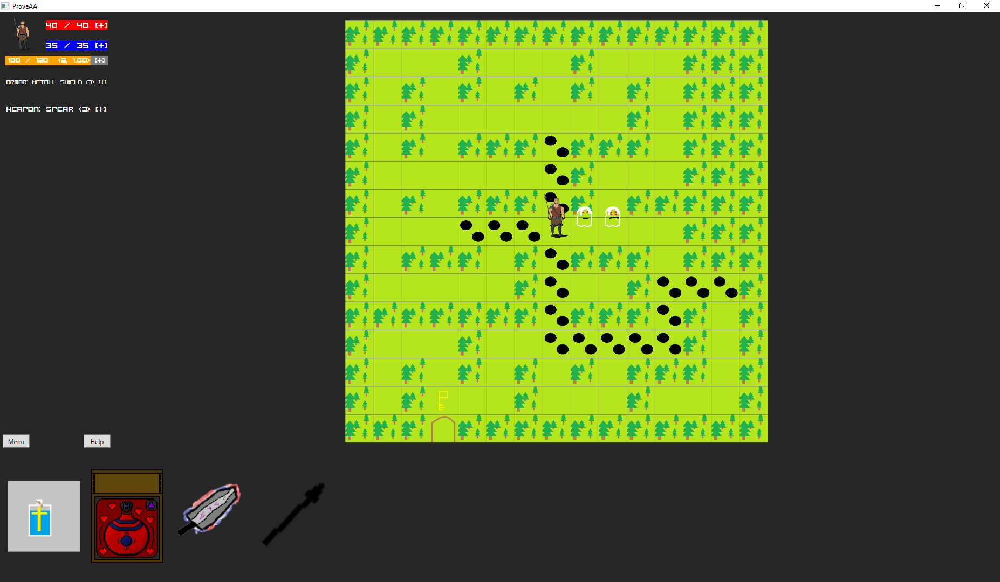
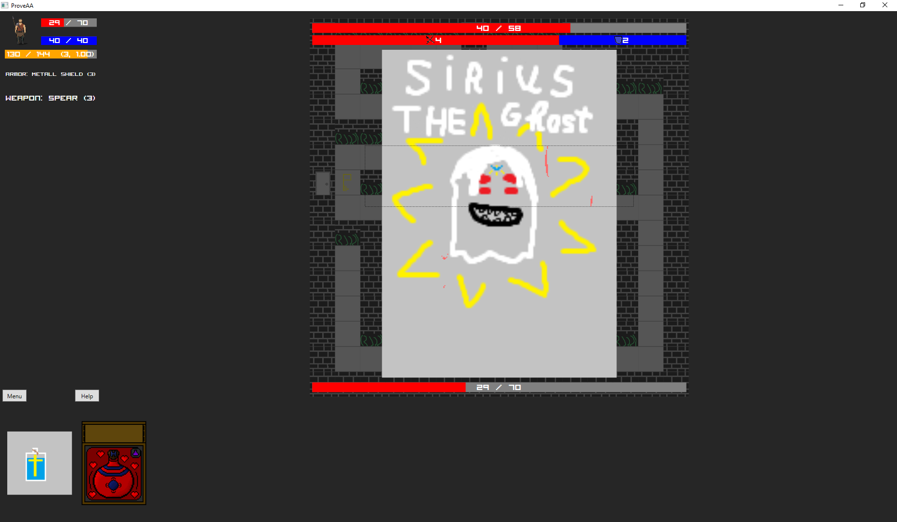

# ProveAA
 Dungeon crawler + card game. All actions(except move and auto-battle) player perform through cards.

## Control
 * WASD/Arrows - move
 * LMB - Use card
 * 1..0 - Use card
 * RMB - Remove card
 * Tab - view global map
 * All cheatcodes in CheatList.txt
 
## Features (Реалізовані, якщо не вказано інакше)
 * Глобальна карта:
	* Розмір 4 х 7. Складається з клеток, в кожній клетці може генеруватися кілька типів рівнів. (Дивитися WorldMap.psd).
	* Типи рівнів, як і їх наповнення не продумано.

 * Карта:
	* Розмір 15х15. Генерується випадково. Для кожної зони можна давати свій тайлсет і фічу в генерації(наприклад в башні вихід завжди по центру).
	* Карта містить максимум 5 дверей і ключів. 1 з них веде на наступний рівень, всі інші відкривають скарби в межах рівня. (Не реалізовано. Місця для дверей позначаються туманом).
	
	
 * Гравець:
	* Гравець може мати максимум 12 карт. Ці карти можуть бути шмотом, магією чи зельями. 
	* Гравець вільно може рухатися всередині рівня. Після виходу з рівня можна згенерувати наступний, або змінити свою позицію на глобальній карті.
	
	* Спочатку в гравця 30 HP і 30 MP. 1 ATK і 1 DEF. 1 LVL  і 1.0 EXP_MOD(множник отриманого досвіду).
	* Для отримання 2 LVL треба набрати 100 EXP. Далі необхідний EXP множиться на 1.2
	* За кожен рівень дає +10 до HP, +5 до MP, і 1 SP. HP і MP відновлюються до максимуму.
	* SP можна вкласти в:
		* HP – + 10
		* MP – +10
		* ATK – +1
		* DEF – +1
		* EXP_MOD - +0.20
		
		
 * Моби:
	* Всі вороги мають атрибути. Наприклад в привида це буде нечисть та привид. Відповідно магія, одноразові предмети чи шмот мають теж свої атрибути. Ці атрибути впливають один на одного і змініють поведінку предмета від трохи до карданально. Наприклад свята вода лікує 100% хп, але в бою з ворогом, що має атрибути нечисть - забирає всю ману та моментально вбиває ворога.
 
	* У кожної зони є певний проміжок LVL мобів.
		* Якщо гравець слабіше чи сильніше зони – то моби будуть максимально доступного LVL.
		* Якщо гравець в рамках зони – то LVL _моба =  LVL _гравеця.
	
	* За кожного ворога базово дає 100 EXP. За кожен LVL(крім 1) дає ще + 10.
	* Далі за кожні 3 LVL на які гравець сильніше моба дає – 25%. За кожні 3 LVL на які гравець слабіше моба дає + 25% до EXP.
	* У кожного ворога є рівень крутості(1-5). Він впливає на HP і EXP ворога. 
		* HP_ворога = HP_гравця / дільник_HP
		* EXP_за_ворога = (100 + 10 * (LVL_гравця-1) + бонус_за_різницю_в_рівні) * множник_EXP. Примітка – гравець отримає EXP_ворога * EXP_MOD
		*  	| рівень крутості | дільник_HP | множник_EXP |
			| --- | --- | --- |
			| 1 | 4   | 1 |
			| 2 | 2   | 2 |
			| 3 | 1.2 | 3 |
			| 4 | 0.8 | 5 |
			| 5 | 0.5 | 6 |
	 
	* У мобів є ATK і DEF. Кожному мобу стати даються випадково і цей шанс різний для кожного типу моба (наприклад 30%/70% 50%/50%). Мінімум 1 стата буде вкинута в атаку.
		* ATK + DEF = Базові_стати_гравця + (LVL_моба-1) + бонус від шмота / 2

 
 * Зелья(Зараз є взагалі не такі, але фундамент для % регенерації закладено):
	* 	|Розмір | HP  | MP  | HP+MP |
		| ---   | --- | --- | ---   |
		| 1 	| 10% | 10% | 10%   |
		| 2 	| 20% | 20% | 25%   |
		| 3 	| 50% | 50% | 60%   |
		| 4 	| 80% | 80% | 100%  |
		
		
 * Магія(Майже не розпочато):
	* У вигляді карт, що забирають ману і роблять певну дію
	
	
 * Пастки:
	* Не відобраєабться на карті
	* Є 2 типи:
		* HP trap – знімає 1/4  текущих HP
		* MP trap – знімає 1/4  текущих MP

		
 * Шмот:
	* Є 2 типи шмоток – зброя і броня. 
	* Шмот як і вороги має певні атрибути.
 
## Tools used:
 * **Code:**
	* Visual studio 2017
	* C#, WPF
	* [WpfAnimatedGif](https://github.com/XamlAnimatedGif/WpfAnimatedGif)
 * **Art:**
	* Paint
	* [Piskel](https://github.com/piskelapp/piskel)
	* Photoshop CS2
	
## SCREENSHOTS
 
 
 
 
